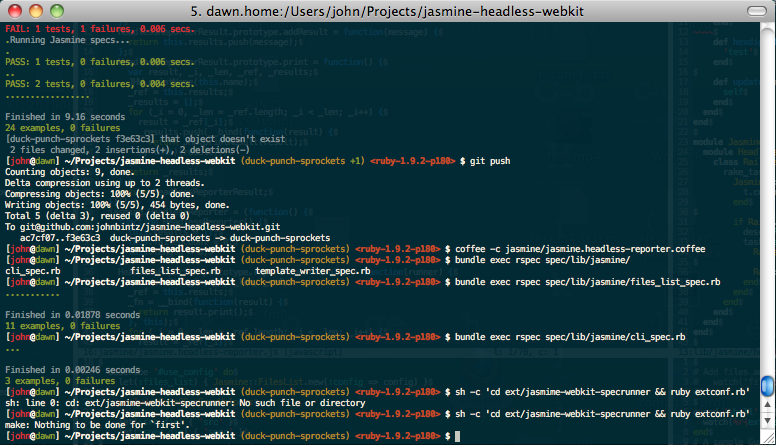
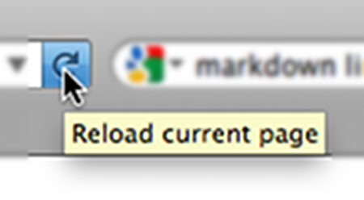

!SLIDE
# Guard and the Modern Rails App #

!SLIDE
## in 5 minutes ##

!SLIDE
### by John Bintz ###

!SLIDE
# Guard? #

!SLIDE center

!SLIDE center

!SLIDE center

[Pocket Watch by Cyberslayer](http://www.flickr.com/photos/cyberslayer/870683349/)

!SLIDE center

[Wrist Brace by lesleyhyphenanne](http://www.flickr.com/photos/lesleyhyphenanne/2878429259/)

!SLIDE
# Get it? #

!SLIDE smaller
    @@@ sh
    gem install guard

!SLIDE smaller
    @@@ sh
    gem install guard-annotate guard-bundler guard-chef \
      guard-coffeedripper guard-coffeescript guard-compass \
      guard-cucumber guard-delayed guard-ego guard-gimli \
      guard-haml guard-jammit guard-jasmine-headless-webkit \
      guard-jstd guard-koans guard-krl guard-less guard-livereload \
      guard-markdown guard-middleman guard-migrate guard-minitest \
      guard-mozrepl guard-nanoc guard-passenger guard-pow \
      guard-prove guard-pusher guard-rails guard-rspec guard-sass \
      guard-shell guard-soca guard-spork guard-sprockets \
      guard-stendhal guard-test guard-uglify guard-webrick 

!SLIDE bullets incremental
# Guards for... #

* Restarting servers
* Compiling files
* Testing things
* Whatever else you feel like automating

!SLIDE
# Guard and the Modern Rails App #

!SLIDE
# A Modern Rails App #

!SLIDE
# Rails 3.0.x #

!SLIDE
## I will touch on Rails 3.1, but since it's not out yet, and the asset pipeline makes some "easy" things much more difficult, I'm saving it for the end. ##

!SLIDE bullets incremental
# This app uses: #

* CoffeeScript >> JS
* SCSS + Compass >> CSS
* Jasmine Headless WebKit >> JS testing
* A web browser
* RSpec >> Ruby testing

!SLIDE
# OMG RSPEC FLAME WARS ON #

!SLIDE center

!SLIDE bullets incremental
# DON'T PANIC #

* `guard-test`
* `guard-minitest`
* `guard-write-your-own`

!SLIDE bullets incremental
# We want Guard to do this when we save files: #

* Run our tests
* Regenerate our CSS & JS
* Reload the page in our browser
* Restart the dev Rails server

!SLIDE
# Only the files a particular Guard action cares about #

!SLIDE
# `.rb && _spec.rb` #

!SLIDE
# `.scss && .sass` #

!SLIDE
# `.js && .coffee` #

!SLIDE
# `config/.*`

!SLIDE
# How? #

!SLIDE smaller
    @@@ sh
    cd ~/my-cool-project

!SLIDE smaller
    @@@ sh
    cd ~/my-cool-project
    guard init

!SLIDE smaller
    @@@ sh
    cd ~/my-cool-project
    guard init
    guard init rspec
    guard init rails
    guard init coffeescript
    guard init compass
    guard init jasmine-headless-webkit
    guard init livereload

!SLIDE evensmaller
    @@@ ruby

    # A sample Guardfile
    # More info at https://github.com/guard/guard#readme

    guard 'rspec', :version => 2 do
      watch(%r{^spec/.+_spec\.rb$})
      watch(%r{^lib/(.+)\.rb$})     { |m| "spec/lib/#{m[1]}_spec.rb" }
      watch('spec/spec_helper.rb')  { "spec" }

      # Rails example
      watch(%r{^spec/.+_spec\.rb$})
      watch(%r{^app/(.+)\.rb$})                           { |m| "spec/#{m[1]}_spec.rb" }
      watch(%r{^lib/(.+)\.rb$})                           { |m| "spec/lib/#{m[1]}_spec.rb" }
      watch(%r{^app/controllers/(.+)_(controller)\.rb$})  { |m| 
        [ "spec/routing/#{m[1]}_routing_spec.rb", 
          "spec/#{m[2]}s/#{m[1]}_#{m[2]}_spec.rb", 
          "spec/acceptance/#{m[1]}_spec.rb" ]
      }
      watch(%r{^spec/support/(.+)\.rb$})                  { "spec" }
      watch('spec/spec_helper.rb')                        { "spec" }
      watch('config/routes.rb')                           { "spec/routing" }
      watch('app/controllers/application_controller.rb')  { "spec/controllers" }
      # Capybara request specs
      watch(%r{^app/views/(.+)/.*\.(erb|haml)$})          { |m| "spec/requests/#{m[1]}_spec.rb" }
    end

    guard 'rails' do
      watch('Gemfile.lock')
      watch(%r{^(config|lib)/.*})
    end

    guard 'coffeescript', :input => 'app/assets/javascripts'

    guard 'compass' do
      watch('^src/(.*)\.s[ac]ss')
    end

!SLIDE evensmaller
    @@@ ruby
    # Run JS and CoffeeScript files in a typical Rails 3.1 fashion, 
    # placing Underscore templates in app/views/*.jst
    # Your spec files end with _spec.{js,coffee}.

    spec_location = "spec/javascripts/%s_spec"

    # uncomment if you use NerdCapsSpec.js
    # spec_location = "spec/javascripts/%sSpec"

    guard 'jasmine-headless-webkit' do
      watch(%r{^app/views/.*\.jst})
      watch(%r{^public/javascripts/(.*)\.js}) { |m| newest_js_file(spec_location % m[1]) }
      watch(%r{^app/assets/javascripts/(.*)\.(js|coffee)}) { |m| newest_js_file(spec_location % m[1]) }
      watch(%r{^spec/javascripts/(.*)_spec\..*}) { |m| newest_js_file(spec_location % m[1]) }
    end

    guard 'livereload' do
      watch(%r{app/.+\.(erb|haml)})
      watch(%r{app/helpers/.+\.rb})
      watch(%r{public/.+\.(css|js|html)})
      watch(%r{config/locales/.+\.yml})
    end

!SLIDE
## [johnbintz-guard-5-min.heroku.com](http://johnbintz-guard-5-min.heroku.com/) ##

!SLIDE
    @@@ sh

    guard
    # and away you go!

!SLIDE
# Yay we're done everyone go home now bye bye #

!SLIDE
# ...let's make this better... #

!SLIDE
    @@@ ruby
    guard 'rspec', :version => 2 do
      watch(%r{something})
    end

    guard 'livereload' do
      watch(%r{something else})
    end

!SLIDE
    @@@ ruby
    # gem 'guard', '>= 0.4.0'

    group :test do
      guard 'rspec', :version => 2 do
        watch(%r{something})
      end
    end

    group :development do
      guard 'livereload' do
        watch(%r{something else})
      end
    end

!SLIDE
    @@@ sh

    # testing code here
    guard -g test

    # stuff for a browser here
    guard -g development

!SLIDE
# But I want Guard to wash my dishes and fold my laundry and take the dog for a walk and -- #

!SLIDE
# Yes! #
## It can! ##

!SLIDE
    @@@ sh

    gem install guard-shell
    guard init shell

!SLIDE small
    @@@ ruby

    guard 'shell' do
      watch(%r{sink/.*\.dish}) { `wash all` }
      watch(%r{dryer/.*\.pants}) { `fold all` }
      watch(%r{dog/(.*)\.dog}) { |m| `walk #{m[1]}` }
    end

!SLIDE
# BACKTICKS ARE FOR THE WEAK #

!SLIDE small
    @@@ ruby

    module Guard
      class NotAWeakling < Guard
        def start
          UI.info "Let's do this..."
        end

        def run_all
          lift_heavy_things
          run(5.miles)
          chin_ups.go!
        end
      end
    end

    guard 'not-a-weakling' do
      watch(%r{.*})
    end

!SLIDE
# Rails 3.1.x and the Asset Pipeline OF DOOM #

!SLIDE
# CSS _should_ be OK... #

!SLIDE
    @@@ ruby
    guard 'livereload' do
      watch(%r{app/.+\.(erb|haml)})
      watch(%r{app/helpers/.+\.rb})
      watch(%r{public/.+\.(css|js|html)})
      watch(%r{config/locales/.+\.yml})
    end

!SLIDE bullets incremental
# But JavaScript testing? #

* CoffeeScript compilation
* Gems that provide JS
* `file.coffee.erb`

!SLIDE

# `file.coffee.erb`

!SLIDE
# Uhhh... #

!SLIDE
# Anyway... #

!SLIDE
# Rack-based test solutions that talk Sprockets... #

!SLIDE
# ...may be OK #

!SLIDE bullets incremental
# The Internets are still figuring out the best way... #

* `jasmine-gem`
* `evergreen`
* ...others...

!SLIDE
# PhantomJS against a running Rack server that can serve asset path files #

!SLIDE small
    @@@ ruby
    guard 'phantomjs', :runner => 'run-jasmine.js' do
      # Rails example
      watch(%r{public/.+\.js})
      watch(%r{^spec/javascripts/.+\.js})
    end

!SLIDE bullets incremental
# Non-Rack-based solutions? #

* Node.js
* Rhino + EnvJS
* `jasmine-headless-webkit`

!SLIDE
## (shameless self-promotion warning!)

!SLIDE
# Compile all that yummy Rails-bound JS before running tests #

!SLIDE small
    @@@ ruby

    # with a newer version of...

    gem 'jasmine-headless-webkit'

    # and the matching guard, this gets run 
    # before each test run:

    Rake::Task['assets:precompile:for_testing'].invoke

!SLIDE small
    @@@ ruby

    # Guardfile
    guard 'jasmine-headless-webkit', :rails_assets => true do
      watch(%r{app/assets/javascripts/.*\.(js|coffee)$})
    end

!SLIDE
    # spec/javascripts/support/jasmine.yml

    src_files:
    - public/assets/*-test.js

!SLIDE center

!SLIDE
# Anyway... #

!SLIDE
# In conclusion... #

!SLIDE
# Install Guard #

!SLIDE
# Use Guard #

!SLIDE
# Type Less #

!SLIDE
# More Time For Beer From A Vending Machine #

!SLIDE center

[Beer Vending Machine by Joel Abroad](http://www.flickr.com/photos/40295335@N00/4849603734/)

!SLIDE bullets
# Thanks! #

* [johnbintz-guard-5-min.heroku.com](http://johnbintz-guard-5-min.heroku.com/)
* [@johnbintz](http://twitter.com/johnbintz)
* [github.com/johnbintz](http://github.com/johnbintz)

